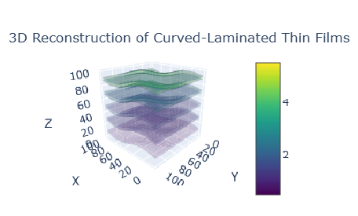

# 3D Reconstruction of Curved-Laminated Thin Films

This repository contains a Python script that generates a synthetic 3D volume representing curved-laminated thin films. The script constructs a 3D model of multiple thin film layers with a realistic curved structure and visualizes the result using Plotly's interactive 3D volume rendering.

## Overview

The code is divided into two primary parts:

1. **Volume Generation:**  
   - **Grid Creation:** Generates a coordinate grid for the x-y plane.
   - **Layer Construction:** Creates multiple layers with curved surfaces using a sine-cosine function to simulate curvature.
   - **Voxel Assignment:** Marks voxels in the 3D volume that belong to each layer based on a specified thickness and curvature.

2. **Visualization:**  
   - **Data Preparation:** Flattens the 3D volume data and coordinate arrays to feed into Plotly.
   - **Volume Rendering:** Uses Plotly's `Volume` class to render isosurfaces for each layer, providing an interactive 3D visualization.

## Requirements

The following Python libraries are required:

- [NumPy](https://numpy.org/) for numerical operations.
- [Plotly](https://plotly.com/python/) for interactive 3D visualization.

## Installation

Install the required packages using pip:

```bash
pip install numpy plotly
```

## Usage

Run the `3D_reconstruction.ipynb` Jupyter notebook.

Upon execution, an interactive 3D plot will open in your default web browser, allowing you to explore the reconstructed volume of curved-laminated thin films.

## Code Explanation

### 1. Generating the Synthetic 3D Volume

- **Volume Initialization:**  
  A 3D NumPy array (`volume`) is initialized with dimensions `(nx, ny, nz)`, representing the voxel grid.

- **Coordinate Grid:**  
  A 2D grid (`X`, `Y`) is created using `np.meshgrid` for the x-y plane.

- **Layer Parameters:**  
  The number of layers (`n_layers`), thickness of each layer (`thickness`), and curvature amplitude (`amplitude`) are defined.

- **Layer Creation:**  
  For each layer:
  - The central z-position is computed.
  - A curvature pattern is generated using a sine-cosine combination.
  - A curved surface is derived by offsetting the central position with the curvature.
  - Voxels within half the layer's thickness from the surface are assigned an intensity corresponding to the layer number.

### 2. Visualizing the 3D Volume with Plotly

- **Data Flattening:**  
  The 3D coordinate arrays (`X_vol`, `Y_vol`, `Z_vol`) and the volume data are flattened to 1D arrays suitable for Plotly's volume rendering.

- **Volume Rendering:**  
  Plotly's `Volume` object is used to create the visualization:
  - **`isomin` & `isomax`:** Define the range of values for isosurface extraction.
  - **`opacity`:** Controls the transparency of the volume.
  - **`surface_count`:** Specifies the number of isosurfaces (one for each layer).
  - **`colorscale`:** Determines the color mapping for the rendered volume.

- **Interactive Display:**  
  The resulting plot is displayed in an interactive window, allowing you to pan, zoom, and rotate the 3D volume.
  

## Customization

- **Layer Configuration:**  
  Modify `n_layers`, `thickness`, and `amplitude` to generate different lamination structures.
  
- **Visualization Settings:**  
  Adjust `isomin`, `isomax`, `opacity`, `surface_count`, and `colorscale` within the Plotly `Volume` configuration to change the rendering style.

## License

This project is open source and available under the [MIT License](LICENSE).

## Acknowledgements

- **NumPy:** Utilized for efficient numerical and array operations.
- **Plotly:** Provides robust tools for interactive 3D data visualization.
```

This README provides a comprehensive overview of the code, its functionality, requirements, and instructions for use.